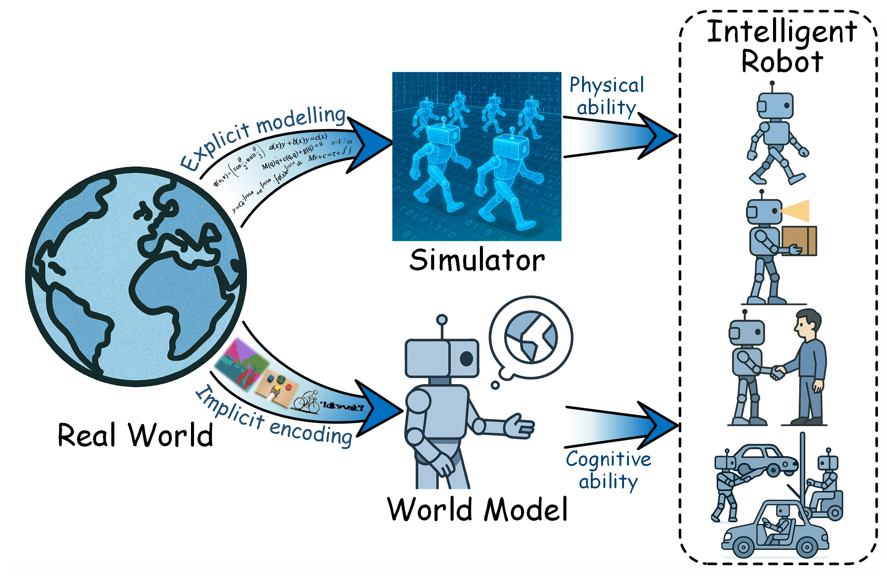
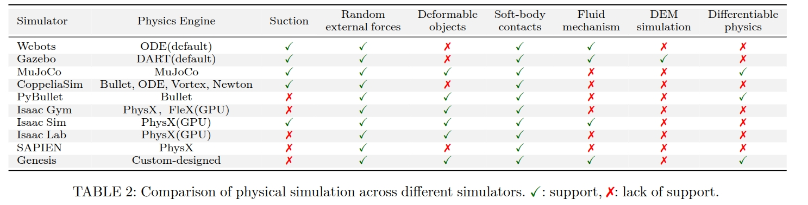
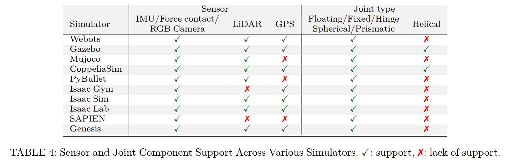
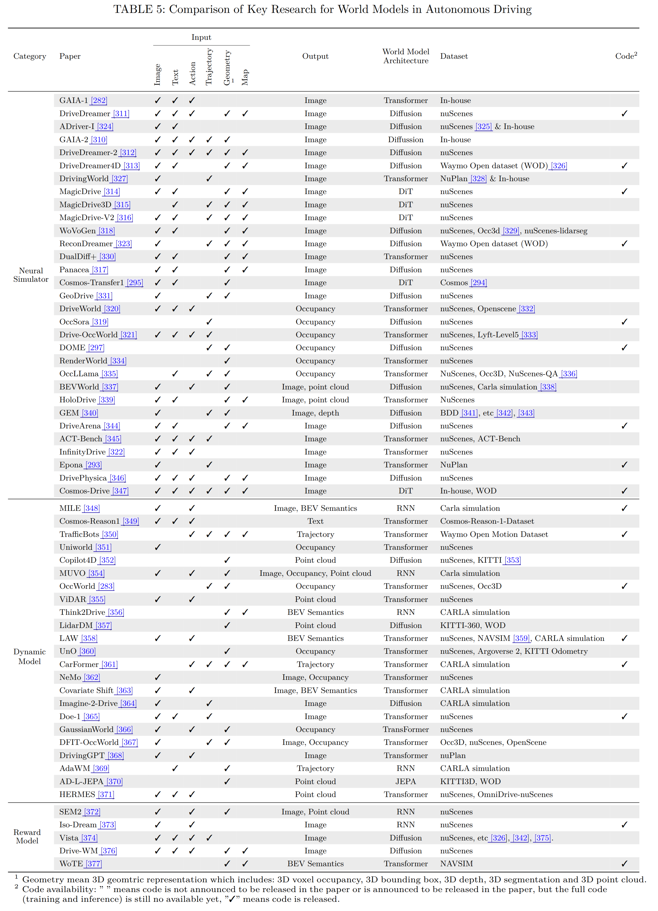

# A Survey: Learning Embodied Intelligence from Physical Simulators and World Models <!-- omit in toc -->

<div align="center">
<!-- <a href="https://arxiv.org/pdf/2506.11526"></a> -->
<a href="https://github.com/NJU3DV-LoongGroup/Embodied-World-Models-Survey/stargazers"></a>
<a href="https://github.com/NJU3DV-LoongGroup/Embodied-World-Models-Survey/network/members"></a>
<a href="https://github.com/NJU3DV-LoongGroup/Embodied-World-Models-Survey/pulls"></a>
<a href="https://github.com/NJU3DV-LoongGroup/Embodied-World-Models-Survey/issues"></a>
<a href="https://github.com/NJU3DV-LoongGroup/Embodied-World-Models-Survey/blob/main/LICENSE"></a>
</div>


<p align="center">

</p>

## 🤝 &nbsp; Citation
Please visit [A Survey: Learning Embodied Intelligence from Physical Simulators and World Models](https://arxiv.org/abs/2507.00917) for more details and comprehensive information.

Author list:
Xiaoxiao Long, Qingrui Zhao, Kaiwen Zhang, Zihao Zhang, Dingrui Wang, Yumeng Liu, Zhengjie Shu, Yi Lu, Shouzheng Wang, Xinzhe Wei, Wei Li, Wei Yin, Yao Yao, Jia Pan, Qiu Shen, Ruigang Yang, Xun Cao, Qionghai Dai


<!-- ```BibTeX
@misc{gao2025foundationmodelsautonomousdriving,
  title={Foundation Models in Autonomous Driving: A Survey on Scenario Generation and Scenario Analysis},
  author={Yuan Gao, Mattia Piccinini, Yuchen Zhang, Dingrui Wang, Korbinian Moller, Roberto Brusnicki, Baha Zarrouki, Alessio Gambi, Jan Frederik Totz, Kai Storms, Steven Peters, Andrea Stocco, Bassam Alrifaee, Marco Pavone and Johannes Betz,
  journal={TBD},
  year={2025},
  eprint={2506.11526},
  archivePrefix={arXiv},
  primaryClass={cs.RO},
  url={https://arxiv.org/abs/2506.11526}, 
}
``` -->

## Table of Content <!-- omit in toc -->
- [1. Introduction](#1-introduction)
- [2. Levels of Intelligent Robot](#2-levels-of-intelligent-robot)
- [3. Robotic Mobility, Dexterity and Interaction](#3-robotic-mobility-dexterity-and-interaction)
  - [Related Robotic Techniques](#related-robotic-techniques)
  - [Robotic Locomotion](#robotic-locomotion)
  - [Robotic Manipulation](#robotic-manipulation)
  - [Human-Robot Interaction](#human-robot-interaction)
- [4. Simulators](#4-simulators)
  - [Mainstream Simulators](#mainstream-simulators)
  - [Physical Properties of Simulators](#physical-properties-of-simulators)
  - [Rendering Capabilities](#rendering-capabilities)
  - [Sensor and Joint Component Types](#sensor-and-joint-component-types)
- [5. World Models](#5-world-models)
- [6. World Models for Intelligent Robots](#6-world-models-for-intelligent-robots)
  - [World Models for Autonomous Driving](#world-models-for-autonomous-driving)
  - [World Models for Articulated Robots](#world-models-for-articulated-robots)

## 1. Introduction

Embodied intelligence provides a foundation for creating robots that can truly understand and reason about the world in a more human-like manner. Central to enabling intelligent behavior in robots are two key technologies: physical simulators and world models. Physical simulators provide controlled, high-fidelity environments for training and evaluating robotic agents, allowing safe and efficient development of complex behaviors. While world models empower robots with internal representations of their surroundings, enabling predictive planning and adaptive decision-making beyond direct sensory input. The synergy between them enhances robots' autonomy, adaptability, and task performance across diverse scenarios.

This repository aims to collect and organize research and resources related to learning embodied AI through the integration of physical simulators and world models.


<p align="center">

</p>

## 2. Levels of Intelligent Robot
To address the absence of a comprehensive grading system that integrates the dimensions of "intelligent cognition" and "autonomous behavior," we outline a capability grading model for intelligent robots, ranging from IR-L0 to IR-L4. This model covers the entire technological evolution, from basic mechanical operation levels to advanced social interaction capabilities.

<p align="center">

</p>


## 3. Robotic Mobility, Dexterity and Interaction

### Related Robotic Techniques
<details>
<summary> Model Predictive Control, MPC </summary>

|Paper| Date    | Venue     |
|---- | ------- | --------- |
| [Model Predictive Control: Theory, Computation, and Design](https://sites.engineering.ucsb.edu/~jbraw/mpc/)     | 2017 | Nob Hill Publishing, LLC  |
| [Model predictive control of legged and humanoid robots: models and algorithms](https://www.tandfonline.com/doi/full/10.1080/01691864.2023.2168134) | 2023-02 | Advanced Robotics |
| [An integrated system for real-time model predictive control of humanoid robots](https://ieeexplore.ieee.org/abstract/document/7029990) | 2013-10 | Humanoids 2013 |
| [Whole-body model-predictive control applied to the HRP-2 humanoid](https://ieeexplore.ieee.org/abstract/document/7353843) | 2015-09 | IROS 2015|
</details>

<details>
<summary> Whole-Body Control, WBC </summary>

|Paper| Date    | Venue     |
|---- | ------- | --------- |
| [Humanoid Robotics: A Reference](https://link.springer.com/referencework/10.1007/978-94-007-7194-9) | 2017 | Springer|
| [A whole-body control framework for humanoids operating in human environments](https://ieeexplore.ieee.org/abstract/document/1642100) | 2006-05 | ICRA 2006 |
| [Hierarchical quadratic programming: Fast online humanoid-robot motion generation](https://journals.sagepub.com/doi/abs/10.1177/0278364914521306) | 2014-05 | The International Journal of Robotics Research |
| [Optimization-based locomotion planning, estimation, and control design for the atlas humanoid robot](https://link.springer.com/article/10.1007/s10514-015-9479-3) | 2015-07 | Autonomous Robots |
| [Compliant locomotion using whole-body control and divergent component of motion tracking](https://ieeexplore.ieee.org/abstract/document/7140001) | 2015-05 | ICRA 2015 |
| [ExBody2: Advanced Expressive Humanoid Whole-Body Control](https://arxiv.org/abs/2412.13196) | 2024-12 | arXiv |
| [A Unified and General Humanoid Whole-Body Controller for Fine-Grained Locomotion](https://arxiv.org/abs/2502.03206) | 2025-02 | arXiv| 
</details>

<details>
<summary> Reinforcement Learning </summary>

|Paper| Date    | Venue     |
|---- | ------- | --------- |
| [Reinforcement learning in robotics: A survey](https://journals.sagepub.com/doi/abs/10.1177/0278364913495721) | 2013-08 | The International Journal of Robotics Research|
| [Learning-based legged locomotion: State of the art and future perspectives](https://journals.sagepub.com/doi/full/10.1177/02783649241312698) | 2025-01 | The International Journal of Robotics Research|
| [Reinforcement learning of dynamic motor sequence: Learning to stand up](https://ieeexplore.ieee.org/abstract/document/724846/) | 1998-10 | IROS 1998|
| [DeepLoco: dynamic locomotion skills using hierarchical deep reinforcement learning](https://dl.acm.org/doi/abs/10.1145/3072959.3073602) | 2017-07 | TOG |
| [Learning symmetric and low-energy locomotion](https://dl.acm.org/doi/abs/10.1145/3197517.3201397)| 2018-07 | TOG| 
| [Emergence of locomotion behaviours in rich environments](https://arxiv.org/abs/1707.02286) | 2017-10 | arXiv|
| [Iterative Reinforcement Learning Based Design of Dynamic Locomotion Skills for Cassie](https://arxiv.org/abs/1903.09537) | 2019-03 | arXiv|
</details>

<details>
<summary> Imitation Learning </summary>

|Paper| Date    | Venue     |
|---- | ------- | --------- |
| [Diffusion policy: Visuomotor policy learning via action diffusion](https://journals.sagepub.com/doi/abs/10.1177/02783649241273668) | 2024-10 | The International Journal of Robotics Research |
| [3d diffusion policy](https://arxiv.org/abs/2403.03954) | 2024-03 | arXiv|
| [Learning Fine-Grained Bimanual Manipulation with Low-Cost Hardware](https://arxiv.org/abs/2304.13705)| 2023-04 | arXiv|
| [RDT-1B: a Diffusion Foundation Model for Bimanual Manipulation](https://arxiv.org/abs/2410.07864) | 2024-10 | arXiv|
| [Diffuseloco: Real-time legged locomotion control with diffusion from offline datasets](https://arxiv.org/abs/2404.19264) | 2024-04 | arXiv|
| [AMP: adversarial motion priors for stylized physics-based character control](https://dl.acm.org/doi/abs/10.1145/3450626.3459670) | 2021-07 | TOG |
| [Whole-body Humanoid Robot Locomotion with Human Reference](https://ieeexplore.ieee.org/abstract/document/10801451) | 2024-10 | IROS 2024|
| [Dexcap: Scalable and portable mocap data collection system for dexterous manipulation](https://arxiv.org/abs/2403.07788)| 2024-03 | arXiv|
| [Open-television: Teleoperation with immersive active visual feedback](https://arxiv.org/abs/2407.01512) | 2024-07| arXiv|
| [Visual Imitation Enables Contextual Humanoid Control](https://arxiv.org/abs/2505.03729) | 2025-05 | arXiv|
</details>

<details>
<summary> Visual-Language-Action Models, VLA </summary>

|Paper| Date    | Venue     |
|---- | ------- | --------- |
| [Rt-2: Vision-language-action models transfer web knowledge to robotic control](https://proceedings.mlr.press/v229/zitkovich23a.html) | 2023-07 | CoRL 2023 |
| [Openvla: An open-source vision-language-action](https://arxiv.org/abs/2406.09246) | 2024-06 | arXiv|
| [3D-VLA: A 3D Vision-Language-Action Generative World Model](https://arxiv.org/abs/2403.09631) | 2024-03 | arXiv|
| [Magma: A foundation model for multimodal ai agents](https://openaccess.thecvf.com/content/CVPR2025/html/Yang_Magma_A_Foundation_Model_for_Multimodal_AI_Agents_CVPR_2025_paper.html) | 2025-06 | CVPR 2025|
| [$π_0$: A Vision-Language-Action Flow Model for General Robot Control](https://arxiv.org/abs/2410.24164) | 2024-10 | arXiv|
| [Fast: Efficient action tokenization for vision-language-action models](https://arxiv.org/abs/2501.09747) |2025-01 | arXiv|
| [Hi robot: Open-ended instruction following with hierarchical vision-language-action models](https://arxiv.org/abs/2502.19417) | 2025-02 | arXiv|
| [TinyVLA: Towards Fast, Data-Efficient Vision-Language-Action Models for Robotic Manipulation](https://arxiv.org/abs/2409.12514)| 2024-09 | arXiv|
| [Vision-Language-Action Models: Concepts, Progress, Applications and Challenges](https://arxiv.org/abs/2505.04769) | 2025-05 | arXiv|
</details>


### Robotic Locomotion


### Robotic Manipulation
<details>
<summary> Gripper-based manipulation </summary>
  
| Paper                                                                                                                                                                                      | Date    | Venue     | Code                                                      |
| ------------------------------------------------------------------------------------------------------------------------------------------------------------------------------------------ | ------- | --------- | --------------------------------------------------------- |
| [Diffusion Policy: Visuomotor Policy Learning via Action Diffusion](https://arxiv.org/abs/2303.04137)     | 2023-03 | RSS 2023  | [Code](https://github.com/real-stanford/diffusion_policy) |
| [RT-1: Robotics Transformer for Real-World Control at Scale](https://arxiv.org/abs/2212.06817)      | 2022-12 | Arxiv                        | [Code](https://github.com/google-research/robotics_transformer) |
| [RT-2: Vision-Language-Action Models Transfer Web Knowledge to Robotic Control](https://robotics-transformer2.github.io/)   | 2023-7  | PMLR 23   | [Code](https://github.com/kyegomez/RT-2)                  |
| [Perceiver-Actor: A Multi-Task Transformer for Robotic Manipulation](https://proceedings.mlr.press/v205/shridhar23a/shridhar23a.pdf) | 2022-9  | CoRL 2022 | [Code](https://github.com/peract/peract)  |
|  [Act3d: 3d feature field transformers for multi-task robotic manipulation](https://arxiv.org/abs/2306.17817)       |   2023-6      |   Arxiv  |   [Code](https://github.com/zhouxian/act3d-chained-diffuser)       |
|  [Modeling of deformable objects for robotic manipulation: A tutorial and review](https://www.frontiersin.org/journals/robotics-and-ai/articles/10.3389/frobt.2020.00082/pdf)     |    2020-9     |   Frontiers in Robotics and AI        |      --         |
| [6-DOF Grasping for Target-driven Object Manipulation in Clutter](https://arxiv.org/abs/1912.03628)          | 2019-12 | ICRA 2020 | --| 
| [Cable manipulation with a tactile-reactive gripper](https://journals.sagepub.com/doi/pdf/10.1177/02783649211027233)|2021-12|IJRR 2021|--|

</details>

<details>
<summary>Dexterous hand manipulation </summary>

| Paper                                                                                                                                         | Date    | Venue                 | Code                                                                |
| --------------------------------------------------------------------------------------------------------------------------------------------- | ------- | --------------------- | ------------------------------------------------------------------- |
| [Dexgraspnet: A large-scale robotic dexterous grasp dataset for general objects based on simulation](https://arxiv.org/pdf/2210.02697)        | 2023-5  | Arxiv                 | [Code](https://github.com/PKU-EPIC/DexGraspNet)                     |
| [DexGraspNet 2.0: Learning Generative Dexterous Grasping in Large-scale Synthetic Cluttered Scenes](https://openreview.net/pdf?id=5W0iZR9J7h) | 2024-10 | CoRL 2024             | [Code](https://github.com/PKU-EPIC/DexGraspNet2)                    |
| [HGC-Net: Deep anthropomorphic hand grasping in clutter](https://ieeexplore.ieee.org/abstract/document/9811756/)                              | 2022-5  | ICRA 2022             | [Code](https://github.com/yimingli1998/hgc_net)                     |
| [Deep differentiable grasp planner for high-dof grippers](https://arxiv.org/abs/2002.01530)                                                   | 2022-2  | Arxiv                 | --                                                                  |
| [DexGrasp Anything: Towards Universal Robotic Dexterous Grasping with Physics Awareness](https://arxiv.org/abs/2503.08257)                    | 2025-3  | Arxiv                 | [Code](https://github.com/4DVLab/DexGrasp-Anything)                 |
| [UGG: Unified Generative Grasping](https://arxiv.org/abs/2311.16917)                                                                          | 2023-11 | ECCV 2004             | [Code](https://github.com/Jiaxin-Lu/ugg)                            |
| [SpringGrasp: Synthesizing Compliant, Dexterous Grasps under Shape Uncertainty](https://arxiv.org/abs/2404.13532)                             | 2024-4  | Arxiv                 | [Code](https://github.com/Stanford-TML/SpringGrasp_release)         |
| [A System for General In-Hand Object Re-Orientation](https://proceedings.mlr.press/v164/chen22a.html)                                         | 2021-11 | CoRL 2021             | [Code](https://github.com/Improbable-AI/dexenv)                     |
| [Visual dexterity: In-hand reorientation of novel and complex object shapes](https://www.science.org/doi/abs/10.1126/scirobotics.adc9244)     | 2023-11 | Science Robotics 2023 | --                                                                  |
| [Rotating without Seeing: Towards In-hand Dexterity through Touch](https://arxiv.org/abs/2303.10880)                                          | 2023-3  | RSS 2023              | [Code](https://github.com/YingYuan0414/in-hand-rotation)            |
| [DexVIP: Learning Dexterous Grasping with Human Hand Pose Priors from Video](https://proceedings.mlr.press/v164/mandikal22a.html)             | 2021-6  | CoRL 2021             | --                                                                  |
| [DexGraspVLA: A Vision-Language-Action Framework Towards General Dexterous Grasping](https://arxiv.org/abs/2502.20900)                        | 2025-2  | Arixv                 | [Code](https://github.com/Psi-Robot/DexGraspVLA?tab=readme-ov-file) |

</details>

<details>
<summary> Bimanual Manipulation Task</summary>

| Paper                                                                                                                                                               | Date    | Venue     | Code                                                           |
| ------------------------------------------------------------------------------------------------------------------------------------------------------------------- | ------- | --------- | -------------------------------------------------------------- |
| [Stabilize to act: Learning to coordinate for bimanual manipulation](https://proceedings.mlr.press/v229/grannen23a.html)                                            | 2023-9  | CoRL 2023 | --                                                             |
| [Interactive imitation learning of bimanual movement primitives](https://ieeexplore.ieee.org/abstract/document/10215052/)                                           | 2023-8  | TMECH     | --                                                             |
| [Learning fine-grained bimanual manipulation with low-cost hardware](https://arxiv.org/abs/2304.13705)                                                              | 2023-4  | RSS 2023  | [Cpde](https://tonyzhaozh.github.io/aloha/)                    |
| [Mobile ALOHA: Learning Bimanual Mobile Manipulation with Low-Cost Whole-Body Teleoperation](https://arxiv.org/abs/2401.02117)                                      | 2024-1  | CoRL 2024 | [Code](https://github.com/MarkFzp/mobile-aloha)                |
| [RoboTwin 2.0: A Scalable Data Generator and Benchmark with Strong Domain Randomization for Robust Bimanual Robotic Manipulation](https://arxiv.org/abs/2506.18088) | 2025-6  | Arxiv     | [Code](https://github.com/robotwin-Platform/RoboTwin)          |
| [Rdt-1b: a diffusion foundation model for bimanual manipulation](https://arxiv.org/abs/2410.07864)                                                                  | 2024-10 | Arxiv     | [Code](https://github.com/thu-ml/RoboticsDiffusionTransformer) |

</details>

<details>
<summary> Whole-Body Manipulation Control</summary>

| Paper                                                                                                                                       | Date    | Venue             | Code                                                |
| ------------------------------------------------------------------------------------------------------------------------------------------- | ------- | ----------------- | --------------------------------------------------- |
| [Tidybot: Personalized robot assistance with large language models](https://link.springer.com/article/10.1007/s10514-023-10139-z)           | 2023-12 | Autonomous Robots | --                                                  |
| [Open-world object manipulation using pre-trained vision-language models](https://arxiv.org/abs/2303.00905)                                 | 2023-2  | Arixv             | [Website](https://robot-moo.github.io/)             |
| [Harmon: Whole-body motion generation of humanoid robots from language descriptions](https://arxiv.org/abs/2410.12773)                      | 2024-10 | CoRL 2024         | [Website](https://ut-austin-rpl.github.io/Harmon/)  |
| [Okami: Teaching humanoid robots manipulation skills through single video imitation](https://openreview.net/forum?id=URj5TQTAXM)            | 2024-10 | CoRL 2024         | [Code](https://github.com/UT-Austin-RPL/OKAMI)      |
| [Generalizable Humanoid Manipulation with 3D Diffusion Policies](https://arxiv.org/abs/2410.10803)                                          | 2024-10 | Arixv             | [Code](https://humanoid-manipulation.github.io/)    |
| [OmniH2O: Universal and Dexterous Human-to-Humanoid Whole-Body Teleoperation and Learning](https://arxiv.org/abs/2406.08858)                | 2024-6  | CoRL 2024         | [Code](https://github.com/LeCAR-Lab/human2humanoid) |
| [HumanPlus: Humanoid Shadowing and Imitation from Humans](https://arxiv.org/abs/2406.10454)                                                 | 2024-6  | CoRL 2024         | [Code](https://github.com/MarkFzp/humanplus)        |
| [BEHAVIOR Robot Suite: Streamlining Real-World Whole-Body Manipulation for Everyday Household Activities](https://arxiv.org/abs/2503.05652) | 2025-3  | Arixv             | [Code](https://behavior-robot-suite.github.io/)     |

</details>

<details>
<summary>Foundation Models in Humanoid Robot Manipulation </summary>

| Paper                                                                                                                                                                                                                                                                                       | Date    | Venue     | Code                                                                          |
| ------------------------------------------------------------------------------------------------------------------------------------------------------------------------------------------------------------------------------------------------------------------------------------------- | ------- | --------- | ----------------------------------------------------------------------------- |
| [Do as i can, not as i say: Grounding language in robotic affordances](https://arxiv.org/abs/2204.01691)                                                                                                                                                                                    | 2024-4  | Arixv     | [Code](https://github.com/google-research/google-research/tree/master/saycan) |
| [Palm-e: An embodied multimodal language model](https://openreview.net/forum?id=VTpHpqM3Cf&utm_campaign=The%20Batch&utm_source=hs_email&utm_medium=email&utm_content=284568789&_hsenc=p2ANqtz-9lsSL4nXMrOGBQqGoqktY5Yno_r9-nTOARZinDcgihFNqcOFEQb_MVtHKdpgI2AC3N8SrNW5PxcD0uxl4WeKcPJgUOgw) | 2023-3  | ICML 2023 | [Website](https://palm-e.github.io/)                                          |
| [Inner monologue: Embodied reasoning through planning with language models](https://arxiv.org/abs/2207.05608)                                                                                                                                                                               | 2022-7  | Arxiv     | [Website](https://innermonologue.github.io/)                                  |
| [Code as policies: Language model programs for embodied control](https://arxiv.org/abs/2209.07753)                                                                                                                                                                                          | 2022-9  | ICRA 2023 | [Code](https://code-as-policies.github.io/)                                   |
| [STIV: Scalable Text and Image Conditioned Video Generation](https://arxiv.org/abs/2412.07730)                                                                                                                                                                                              | 2024-12 | Arxiv     | --                                                                            |
| [GR00T N1: An open foundation model for generalist humanoid robots](https://arxiv.org/abs/2503.14734)                                                                                                                                                                                       | 2025-3  | Arxiv     | [Code](https://github.com/NVIDIA/Isaac-GR00T)                                 |
| [$\pi_0$: A Vision-Language-Action Flow Model for General Robot Control](https://arxiv.org/abs/2410.24164)                                                                                                                                                                                  | 2024-10 | Arxiv     | [Code](https://github.com/Physical-Intelligence/openpi)                       |
| [Openvla: An open-source vision-language-action model](https://arxiv.org/abs/2406.09246)                                                                                                                                                                                                    | 2024-6  | Arxiv     | [Code](https://github.com/OpenVLA/openvla)                                    |
| [Gr-2: A generative video-language-action model with web-scale knowledge for robot manipulation](https://arxiv.org/abs/2410.06158)                                                                                                                                                          | 2024-10 | Arxiv     | [Website](https://gr2-manipulation.github.io/)                                |

</details>

### Human-Robot Interaction
<details>
<summary>Related Survey</summary>

| Paper | Date | Venue |
|:------|:-----|:------|
| [Humanlike service robots: A systematic literature review and research agenda](https://doi.org/10.1002/mar.22099) | 2024-08 |  Psychology & Marketing |
|[Human–robot collaboration and machine learning: A systematic review of recent research](https://doi.org/10.1016/j.rcim.2022.102432)| 2023-02 | Robotics and Computer-Integrated Manufacturing |
| [Emotion Recognition for Human-Robot Interaction: Recent Advances and Future Perspectives](https://doi.org/10.3389/frobt.2020.532279) | 2020-12 | Frontiers in Robotics and AI |
|[Application, Development and Future Opportunities of Collaborative Robots (Cobots) in Manufacturing: A Literature Review](https://doi.org/10.1080/10447318.2022.2041907)| 2022-04 |  International Journal of Human–Computer Interaction |
|[Towards Social AI: A Survey on Understanding Social Interactions](https://arxiv.org/abs/2409.15316)|2024-09|arXiv|
|[Human–robot interaction: A review and analysis on variable admittance control, safety, and perspectives](https://doi.org/10.3390/machines10070591)|2022-07|Machines|
|[Human-robot perception in industrial environments: A survey](https://doi.org/10.3390/s21051571)|2021-02|Sensors|


</details>

<details>
<summary>Cognitive Collaboration</summary>

| Paper | Date | Venue | Code | Task |
|:------|:-----|:------|:-----|:-----|
| [Artificial cognition for social human–robot interaction: An implementation](https://doi.org/10.1016/j.artint.2016.07.002) | 2017-06 | Artificial Intelligence | -- | Robot Cognitive Skills |
| [Cognitive Interaction Analysis in Human–Robot Collaboration Using an Assembly Task](https://doi.org/10.3390/electronics10111317) | 2021-05 | Electronics | -- | Assembly Collabotation |
|[Enhancing Robotic Collaborative Tasks Through Contextual Human Motion Prediction and Intention Inference](https://link.springer.com/article/10.1007/s12369-024-01140-2)| 2024-07 |  International Journal of Social Robotics  | -- | Human-Robot Handover |
|[L3MVN: Leveraging Large Language Models for Visual Target Navigation](https://arxiv.org/abs/2304.05501)| 2023-10 | IROS 2023 | [Github](https://github.com/ybgdgh/L3MVN) | Object Goal Navigation |
|[SG-Nav: Online 3D Scene Graph Prompting for LLM-based Zero-shot Object Navigation](https://arxiv.org/abs/2410.08189)| 2024-10 | NeurIPS 2024 | [Github](https://github.com/bagh2178/SG-Nav) | Object Goal Navigation |
|[TriHelper: Zero-Shot Object Navigation with Dynamic Assistance](https://arxiv.org/abs/2403.15223)| 2024-03 | IROS 2024 | -- | Object Goal Navigation |
|[CogNav: Cognitive Process Modeling for Object Goal Navigation with LLMs](https://openreview.net/forum?id=fRl85QEpgQ)| 2024-10 | NeurIPS 2024 OWA Workshop| -- | Object Goal Navigation |
| [UniGoal: Towards Universal Zero-shot Goal-oriented Navigation](https://arxiv.org/abs/2503.10630) | 2025-03 | CVPR 2025 | [Github](https://github.com/bagh2178/UniGoal) | Goal-oriented Navigation  |

</details>

<details>
<summary>Physical Reliability</summary>

| Paper | Date | Venue | Code | Remarks |
|:------|:-----|:------|:-----|:-----|
|[A Comparative Study of Probabilistic Roadmap Planners](https://link.springer.com/chapter/10.1007/978-3-540-45058-0_4)| 2004 | Algorithmic foundations of robotics V | -- | Probabilistic Roadmap Planning (PRM) |
|[Rapidly-exploring random trees: A new tool for Path Planning](https://msl.cs.illinois.edu/~lavalle/papers/Lav98c.pdf)| 1998 | Research Report | -- | Rapidly-exploring Random Trees (RRT) |
|[Sampling-based Algorithms for Optimal Motion Planning](https://arxiv.org/abs/1105.1186)|2011-05|International Journal of Robotics Research| -- |PRM* and RRT*|
| [Path planning for manipulators based on an improved probabilistic roadmap method](https://doi.org/10.1016/j.rcim.2021.102196) | 2021-12 | Robotics and Computer-Integrated Manufacturing | -- | Path Planning for Manipulators |
|[RRT-connect: An efficient approach to single-query path planning](https://doi.org/10.1109/ROBOT.2000.844730)|2000-04|ICRA 2000| -- | Incrementally build two RRTs from the start and goal. |
|[Homotopy-Aware RRT*: Toward Human-Robot Topological Path-Planning](https://dl.acm.org/doi/10.5555/2906831.2906880)|2016-03|11th ACM/IEEE International Conference on Human-Robot Interaction|--|Human-robot Interactive Path-planning|
|[Human-in-the-loop Robotic Manipulation Planning for Collaborative Assembly](https://arxiv.org/abs/1909.11280)|2019-09|IEEE Transactions on Automation Science and Engineering| -- |Human-robot Interactive Path-planning|
|[CHOMP: Gradient optimization techniques for efficient motion planning](https://doi.org/10.1109/ROBOT.2009.5152817)|2009-05|ICRA 2009|[MoveIt!](https://github.com/moveit/moveit_tutorials/blob/master/doc/chomp_planner/chomp_planner_tutorial.rst)|Gradient-based Trajectory Optimization|
|[STOMP: Stochastic trajectory optimization for motion planning](https://doi.org/10.1109/ICRA.2011.5980280)|2011-05|ICRA 2011|[MoveIt!](https://moveit.github.io/moveit_tutorials/doc/stomp_planner/stomp_planner_tutorial.html)|Probabilistic Trajectory Optimization|
|[ITOMP: Incremental trajectory optimization for real-time replanning in dynamic environments](https://doi.org/10.1609/icaps.v22i1.13513)|2012-05|Proceedings of the International Conference on Automated Planning and Scheduling|[Github](https://github.com/Chpark/itomp)|Trajectory Optimization in Dynamic Environment|
|[Motion planning with sequential convex optimization and convex collision checking](https://rll.berkeley.edu/~sachin/papers/Schulman-IJRR2014.pdf)|2014|IJRR 2014| -- |Trajectory Optimization using SCO|
|[Considering avoidance and consistency in motion planning for human-robot manipulation in a shared workspace](https://doi.org/10.1109/ICRA.2016.7487584)|2016-05|ICRA 2016| -- |Human-robot Interactive Path-planning|
|[Considering Human Behavior in Motion Planning for Smooth Human-Robot Collaboration in Close Proximity](https://doi.org/10.1109/ROMAN.2018.8525607)|2018-08|27th IEEE International Symposium on Robot and Human Interactive Communication| -- |Human-robot Interactive Path-planning|
|[Continuous-time Gaussian process motion planning via probabilistic inference](https://arxiv.org/abs/1707.07383)|2017-07|IJRR 2018| -- | Gaussian Process Motion Planner (GPMP) |
|[Simultaneous Scene Reconstruction and Whole-Body Motion Planning for Safe Operation in Dynamic Environments](https://arxiv.org/abs/2103.03958)|2021-03|IROS 2021| -- |GPMP for Whole-body Motion Planning in Dynamic Scene|
|[Admittance control for collaborative dual-arm manipulation](https://doi.org/10.1109/ICAR46387.2019.8981624)|2019-12|International Conference on Advanced Robotics| -- |Admittance Control|
|[Cooperative control of dual-arm robots in different human-robot collaborative tasks](https://www.emerald.com/insight/content/doi/10.1108/aa-12-2018-0264/full/html)|2020-02|Assembly Automation| -- |Admittance Control|
|[Control system design and methods for collaborative robots](https://doi.org/10.3390/app13010675)|2023-01|Applied Sciences| -- |Interactive Control System|
|[Towards shared autonomy framework for human-aware motion planning in industrial human-robot collaboration](https://doi.org/10.1109/CASE48305.2020.9217003)|2020-08|International Conference on Automation Science and Engineering| -- |Industrial HRI|
|[An actor-critic approach for legible robot motion planner](https://doi.org/10.1109/ICRA40945.2020.9197102)|2020-05|ICRA 2020| -- |RL Method|
|[A task-adaptive deep reinforcement learning framework for dual-arm robot manipulation](https://doi.org/10.1109/TASE.2024.3352584)|2024-01|IEEE Transactions on Automation Science and Engineering| -- |RL Method|
|[Learning robust skills for tightly coordinated arms in contact-rich tasks](https://doi.org/10.1109/LRA.2024.3359542)|2024-01|IEEE RAL| -- |RL Method|
|[HandoverSim: A Simulation Framework and Benchmark for Human-to-Robot Object Handovers](https://arxiv.org/abs/2205.09747)|2022-05|ICRA 2022|[Github](https://github.com/NVlabs/handover-sim)|Benchmark|
|[GenH2R: Learning Generalizable Human-to-Robot Handover via Scalable Simulation, Demonstration, and Imitation](https://arxiv.org/abs/2401.00929)|2024-01|CVPR 2024|[Github](https://github.com/chenjy2003/genh2r)|Imitation Learning|
|[MobileH2R: Learning Generalizable Human to Mobile Robot Handover Exclusively from Scalable and Diverse Synthetic Data](https://arxiv.org/abs/2501.04595)|2025-01|CoRR 2025| -- |Imitation Learning|


</details>

<details>
<summary>Social Embeddedness</summary>

| Paper | Date | Venue | Links | Remarks |
|:------|:-----|:------|:-----|:-----|
|[The space between us: A neurophilosophical framework for the investigation of human interpersonal space](https://doi.org/10.1016/j.neubiorev.2008.09.007)|2009-03|Neuroscience & Biobehavioral Reviews| -- |Peripersonal Space |
|[The interrelation between peripersonal action space and interpersonal social space: psychophysiological evidence and clinical implications](https://doi.org/10.3389/fnhum.2021.636124)|2021-02|Frontiers in Human Neuroscience| -- | Peripersonal Space |
|[Robot-assisted shopping for the blind: issues in spatial cognition and product selection](https://link.springer.com/article/10.1007/s11370-008-0020-9)|2008-03|Intelligent Service Robotics| -- |Application in Social Scenario|
|[A review of assistive spatial orientation and navigation technologies for the visually impaired](https://link.springer.com/article/10.1007/s10209-017-0570-8)|2017-08|Universal Access in the Information Society| -- |Application in Social Scenario|
|[ShelfHelp: Empowering Humans to Perform Vision-Independent Manipulation Tasks with a Socially Assistive Robotic Cane](https://arxiv.org/abs/2405.20501)|2024-05| arXiv | -- |Application in Social Scenario |
|[Conversational memory network for emotion recognition in dyadic dialogue videos](https://pmc.ncbi.nlm.nih.gov/articles/PMC7098709/pdf/nihms-1574715.pdf)|2018-06|Proceedings of the conference. Association for Computational Linguistics| -- | Linguistic Research |
|[Graph Based Network with Contextualized Representations of Turns in Dialogue](https://arxiv.org/abs/2109.04008)|2021-09|EMNLP 2021| -- |Linguistic Research|
|[DialogueGCN: A Graph Convolutional Neural Network for Emotion Recognition in Conversation](https://arxiv.org/abs/1908.11540)|2019-08|EMNLP 2019| -- |Linguistic Research|
|[Dialogue act modeling for automatic tagging and recognition of conversational speech](https://direct.mit.edu/coli/article-pdf/26/3/339/1797531/089120100561737.pdf)|2000-10|Computational Linguistics| -- |Linguistic Research|
|[Werewolf among us: Multimodal resources for modeling persuasion behaviors in social deduction games](https://arxiv.org/abs/2212.08279)|2022-12|ACL 2023| -- |Linguistic Research|
|[The Call for Socially Aware Language Technologies](https://arxiv.org/abs/2405.02411)|2025-02|pre-MIT Press publication version| -- |Linguistic Research|
|[LD-ConGR: A Large RGB-D Video Dataset for Long-Distance Continuous Gesture Recognition](https://isrc.iscas.ac.cn/zhanglibo/pdfs/2022/CVPR_2022_03.pdf)|2022-06|CVPR 2022|[Github](https://github.com/Diananini/LD-ConGR-CVPR2022)| Non-verbal Behaviors Study |
|[The Audio-Visual Conversational Graph: From an Egocentric-Exocentric Perspective](https://arxiv.org/abs/2312.12870)|2023-12|CVPR 2024|[Github](https://github.com/VJWQ/AV-CONV)| Non-verbal Behaviors Study|
|[SocialGesture: Delving into Multi-person Gesture Understanding](https://arxiv.org/abs/2504.02244)|2025-04|CVPR 2025|[Dataset](https://huggingface.co/datasets/IrohXu/SocialGesture) |Non-verbal Behaviors Study|
|[JRDB-Social: A Multifaceted Robotic Dataset for Understanding of Context and Dynamics of Human Interactions Within Social Groups](https://arxiv.org/abs/2404.04458)|2024-04|CVPR 2024|[Project Page](https://jrdb.erc.monash.edu/)|HRI in Social Group|
|[MRAC Track 1: 2nd Workshop on Multimodal, Generative and Responsible Affective Computing](https://arxiv.org/abs/2409.07256)|2024-09|ACM MM Workshop 2024|[Workshop Page](https://react-ws.github.io/2024/)|Affective Computing|
|[The Tong Test: Evaluating Artificial General Intelligence Through Dynamic Embodied Physical and Social Interactions](https://doi.org/10.1016/j.eng.2023.07.006)|2024-03|Engineering| -- | Evaluation of AGI in Social Interaction|
</details>

## 4. Simulators
<details>
<summary> Related Survey </summary>

| Paper | Date | Venue | Code | Application |
|:------|:-----|:------|:-----|:------------|
| [A Review of Physics Simulators](https://ieeexplore.ieee.org/document/9386154) | 2021 | IEEE Access | – | Simlulator Survey |
| [Review of Embodied AI](https://arxiv.org/pdf/2407.06886) | 2025 | arXiv | – | Embodied AI Survey |
| [A Survey of Embodied AI](https://arxiv.org/pdf/2103.04918) | 2022 | arXiv | – | Embodied AI Survey |

</details>

<details>
<summary> Related Works </summary>

| Paper | Date | Venue | Code | Application |
|:------|:-----|:------|:-----|:------------|
| [ManiSkill3](https://arxiv.org/abs/2410.00425) | 2024 | arXiv | – | Manipulation Benchmark |
| [ManiSkill2](https://openreview.net/forum?id=K5z_LXnL3p4) | 2023 | ICLR | – | Manipulation Benchmark |
| [Analysis using DEM](https://ieeexplore.ieee.org/document/9172795) | 2020 | IEEE Aerospace | – | Granular Simulation |
| [Mobile Aloha](https://arxiv.org/abs/2401.02117) | 2024 | arXiv | – | Teleoperation |
| [Open-Television](https://arxiv.org/abs/2407.01512) | 2024 | arXiv | – | Teleoperation |
| [Universal Manipulation Interface](https://arxiv.org/abs/2402.10329) | 2024 | arXiv | – | Imitation Learning |

</details>

### Mainstream Simulators
<details>
<summary> Overview and Documentation</summary>

| Paper | Date | Venue | Code | Application |
|:------|:-----|:------|:-----|:------------|
| [**Webots**: Professional Mobile Robot Simulation](http://www.ars-journal.com/International-Journal-of-Advanced-Robotic-Systems/Volume-1/39-42.pdf) | 2004 | JARS | – | Simulator Platform |
| [Design and use paradigms for **Gazebo**](https://doi.org/10.1109/IROS.2004.1389727) | 2004 | IROS | – | Simulator Platform |
| [**MuJoCo**: A physics engine for model-based control](https://ieeexplore.ieee.org/document/6386109) | 2012 | IROS | – | Simulator Platform |
| [**PyBullet**: Python module for physics simulation](http://pybullet.org) | 2016 | GitHub | [GitHub](http://pybullet.org) | Simulator Platform |
| [**CoppeliaSim** (formerly V-REP)](https://www.coppeliarobotics.com) | 2013 | IROS | – | Simulator Platform |
| [**Isaac Gym**: GPU-based physics simulation for robot learning](https://arxiv.org/abs/2108.10470) | 2021 | arXiv | – | Simulator Platform |
| [**Isaac Sim**](https://developer.nvidia.com/isaac/sim) | 2025 | NVIDIA Developer | – | Simulator Platform |
| [**Isaac Lab** Documentation](https://isaac-sim.github.io/IsaacLab/main/index.html) | 2025 | NVIDIA Developer | – | Simulator Platform |
| [**SAPIEN**: A simulated part-based interactive environment](https://openaccess.thecvf.com/content_CVPR_2020/html/Xiang_SAPIEN_A_Simulated_Part-Based_Interactive_Environment_CVPR_2020_paper.html) | 2020 | CVPR | – | Simulator Platform |
| [**Genesis**: A Universal and Generative Physics Engine](https://github.com/Genesis-Embodied-AI/Genesis) | 2024 | GitHub | [GitHub](https://github.com/Genesis-Embodied-AI/Genesis) | Simulator Platform |
| [MuJoCo Programming Guide](https://mujoco.readthedocs.io/en/stable/programming/index.html) | 2025 | Docs | – | Developer Guide |
| [Newton Isaac Sim Project](https://github.com/TheNewtonCapstone/newton-isaac-sim) | 2024 | GitHub | [GitHub](https://github.com/TheNewtonCapstone/newton-isaac-sim) | Simulator Platform |
| [Newton Physics Engine Announcement](https://developer.nvidia.com/blog/announcing-newton-an-open-source-physics-engine-for-robotics-simulation/) | 2025 | NVIDIA Blog | – | Physics Engine |

</details>

### Physical Properties of Simulators


<p align="center">

</p>


<details>
<summary> Physical Simulation Engines and Platforms </summary>

| Paper | Date | Venue | Code | Application |
|:------|:-----|:------|:-----|:------------|
| [LS Group Interact Kinematics](https://documentation.ls-group.fr/interact/kinematics/) | 2025 | Docs | – | Kinematics Documentation |
| [NVIDIA Omniverse](https://www.nvidia.com/en-us/omniverse/) | 2025 | NVIDIA Developer | – | 3D Simulation & Collaboration Platform |
| [NVIDIA PhysX System Software](https://www.nvidia.cn/drivers/physx/physx-9-21-0713-driver/) | 2021 | NVIDIA Developer | – | Real-Time Physics Engine |

</details>

### Rendering Capabilities

<p align="center">

</p>


<details>
<summary> Rendering Engines and Framework </summary>

| Paper | Date | Venue | Code | Application |
|:------|:-----|:------|:-----|:------------|
| [LuisaRender](https://dl.acm.org/doi/10.1145/3550454.3555471) | 2022 | TOG | – | Rendering Framework |
| [Pyrender](https://github.com/mmatl/pyrender) | 2019 | GitHub | [GitHub](https://github.com/mmatl/pyrender) | Rendering |
| [HydraRendererInfo](https://github.com/Ray-Tracing-Systems/HydraRendererInfo) | 2019 | GitHub | [GitHub](https://github.com/Ray-Tracing-Systems/HydraRendererInfo) | Rendering |
| [The Alliance for OpenUSD](https://aousd.org/) | 2023 | AOUSD | – | Open Universal Scene Description (USD) Standard |
| [OpenGL: The Industry Standard for High‑Performance Graphics](https://www.opengl.org/) | 1992 | Khronos Group | – | Cross-Platform Graphics API |
| [Vulkan: Cross‑Platform 3D Graphics and Compute API](https://www.vulkan.org/) | 2016 | Khronos Group | – | Low-Level Graphics and Compute API |
| [NVIDIA OptiX™ Ray Tracing Engine](https://developer.nvidia.com/rtx/ray-tracing/optix) | 2024 | NVIDIA Developer | – | GPU-Accelerated Ray Tracing Framework |

</details>

### Sensor and Joint Component Types

<p align="center">

</p>

## 5. World Models
<details>
<summary>Representative Architectures of World Models</summary>

| Paper | Date | Venue | Code | Architecture |
|:------|:-----|:------|:-----|:------------|
| [World Models](https://arxiv.org/abs/1803.10122) | 2018-03 | NeurIPS 2018 | - | RSSM |
| [Learning Latent Dynamics for Planning from Pixels](https://arxiv.org/abs/1811.04551) | 2018-11 | ICML 2019 | [Github](https://github.com/google-research/planet) | RSSM |
| [Dream to Control: Learning Behaviors by Latent Imagination (Dreamer)](https://arxiv.org/abs/1912.01603) | 2019-12 | ICLR 2020 | [Github](https://github.com/danijar/dreamer) | RSSM |
| [Mastering Atari with Discrete World Models (Dreamer v2)](https://arxiv.org/abs/2010.02193) | 2020-10 | ICLR 2021 | [Github](https://github.com/danijar/dreamerv2) | RSSM |
| [DayDreamer: World Models for Physical Robot Learning](https://arxiv.org/abs/2206.14176) | 2022-06 | CoRL 2022 | [Github](https://github.com/danijar/daydreamer) | RSSM |
| [Mastering Diverse Domains through World Models (Dreamer v3)](https://arxiv.org/abs/2301.04104v2) | 2023-01 | Nature | [Github](https://github.com/danijar/dreamerv3) | RSSM |
| [A Path Towards Autonomous Machine Intelligence](https://openreview.net/pdf?id=BZ5a1r-kVsf) | 2022-06 | OpenReview | - | JEPA |
| [Self-Supervised Learning from Images with a Joint-Embedding Predictive Architecture (I-JEPA)](https://arxiv.org/abs/2301.08243) | 2023-01 | CVPR 2023 | [Github](https://github.com/facebookresearch/ijepa) | JEPA |
| [Revisiting Feature Prediction for Learning Visual Representations from Video (V-JEPA)](https://arxiv.org/abs/2404.08471) | 2024-04 | arXiv | [Github](https://github.com/facebookresearch/jepa) | JEPA |
| [V-JEPA 2: Self-Supervised Video Models Enable Understanding, Prediction and Planning](https://arxiv.org/abs/2506.09985) | 2025-06 | arXiv | [Github](https://github.com/facebookresearch/vjepa2) | JEPA |
| [TransDreamer: Reinforcement Learning with Transformer World Models](https://arxiv.org/abs/2202.09481) | 2022-02 | NeurIPS 2021 Workshop | [Github](https://github.com/changchencc/TransDreamer) | TSSM |
| [Transformer-based World Models Are Happy With 100k Interactions](https://arxiv.org/abs/2303.07109) | 2023-03 | ICLR 2023 | [Github](https://github.com/jrobine/twm) | TSSM |
| [Genie: Generative Interactive Environments](https://arxiv.org/abs/2402.15391) | 2024-02 | arXiv | - | TSSM |
| [GAIA-1: A Generative World Model for Autonomous Driving](https://arxiv.org/abs/2309.17080) | 2023-09 | arXiv Wayve | - | Autoregressive Transformer |
| [OccWorld: Learning a 3D Occupancy World Model for Autonomous Driving](https://arxiv.org/abs/2311.16038) | 2023-11 | ECCV 2024 | [Github](https://github.com/wzzheng/OccWorld) | Autoregressive Transformer |
| [Video generation models as world simulators (Sora)](https://openai.com/index/video-generation-models-as-world-simulators/) | 2024-02 | OpenAI | - | Diffusion |
| [Vista: A Generalizable Driving World Model with High Fidelity and Versatile Controllability](https://arxiv.org/abs/2405.17398) | 2024-05 | NeurIPS 2024 | [Github](https://github.com/OpenDriveLab/Vista) | Diffusion |
| [GAIA-2: A Controllable Multi-View Generative World Model for Autonomous Driving](https://arxiv.org/abs/2503.20523) | 2025-03 | arXiv Wayve | - | Diffusion |
| [Vid2World: Crafting Video Diffusion Models to Interactive World Models](https://arxiv.org/abs/2505.14357) | 2025-05 | arXiv | - | AR+Diffusion |
| [Epona: Autoregressive Diffusion World Model for Autonomous Driving](https://arxiv.org/abs/2506.24113) | 2025-06 | ICCV 2025 | [Github](https://github.com/Kevin-thu/Epona) | AR+Diffusion |

</details>

<details>
<summary>Core roles of World Models</summary>

| Paper | Date | Venue | Code | Role |
|:------|:-----|:------|:-----|:------------|
| [Cosmos World Foundation Model Platform for Physical AI](https://arxiv.org/abs/2501.03575) | 2025-03 | arXiv | [Github](https://github.com/nvidia-cosmos/cosmos-predict1)| Neural Simulator |
| [Cosmos-Transfer1: Conditional World Generation with Adaptive Multimodal Control](https://arxiv.org/abs/2503.14492) | 2025-04 | arXiv | [GitHub](https://github.com/nvidia-cosmos/cosmos-transfer1) | Neural Simulator |
| [GAIA-1: A Generative World Model for Autonomous Driving](https://arxiv.org/abs/2309.17080) | 2023-09 | arXiv Wayve | - | Neural Simulator |
| [GAIA-2: A Controllable Multi-View Generative World Model for Autonomous Driving](https://arxiv.org/abs/2503.20523) | 2025-03 | arXiv Wayve | - | Neural Simulator |
| [DriveWorld: 4D Pre-trained Scene Understanding via World Models for Autonomous Driving](https://arxiv.org/abs/2405.04390) | 2024-05 | CVPR 2024 | - | Neural Simulator |
| [DOME: Taming Diffusion Model into High-Fidelity Controllable Occupancy World Model](https://arxiv.org/abs/2410.10429) | 2024-10 | arXiv | [GitHub](https://github.com/gusongen/DOME) | Neural Simulator |
| [Dream to Control: Learning Behaviors by Latent Imagination (Dreamer)](https://arxiv.org/abs/1912.01603) | 2019-12 | ICLR 2020 | [Github](https://github.com/danijar/dreamer) | Dynamic Model |
| [Mastering Atari with Discrete World Models (Dreamer v2)](https://arxiv.org/abs/2010.02193) | 2020-10 | ICLR 2021 | [Github](https://github.com/danijar/dreamerv2) | Dynamic Model |
| [DayDreamer: World Models for Physical Robot Learning](https://arxiv.org/abs/2206.14176) | 2022-06 | CoRL 2022 | [Github](https://github.com/danijar/daydreamer) | Dynamic Model |
| [Mastering Diverse Domains through World Models (Dreamer v3)](https://arxiv.org/abs/2301.04104v2) | 2023-01 | Nature | [Github](https://github.com/danijar/dreamerv3) | Dynamic Model |
| [Pre-training Contextualized World Models with In-the-wild Videos for Reinforcement Learning](https://arxiv.org/abs/2305.18499) | 2023-05 | NeurIPS 2023 | [Github](https://github.com/thuml/ContextWM) | Dynamic Model |
| [iVideoGPT: Interactive VideoGPTs are Scalable World Models](https://arxiv.org/abs/2405.15223) | 2024-05 | NeurIPS 2024 | [Github](https://github.com/thuml/iVideoGPT) | Dynamic Model |
| [Video Prediction Models as Rewards for Reinforcement Learning (VIPER)](https://arxiv.org/abs/2305.14343) | 2023-05 | NeurIPS 2023 | [Github](https://github.com/Alescontrela/viper_rl) | Reward Model |

</details>

## 6. World Models for Intelligent Robots

### World Models for Autonomous Driving

<details>
<summary> Table </summary>

<p align="center">

</p>

</details>

<details>
<summary> WMs as Neural Simulators for Autonomous Driving </summary>

| Paper | Date | Venue | Code | Application |
|:------|:-----|:------|:-----|:------------|
| [GAIA-1: A Generative World Model for Autonomous Driving](https://arxiv.org/abs/2309.17080) | 2023-09 | arXiv Wayve | - | Scenario Generation |
| [DriveDreamer: Towards Real-world-driven World Models for Autonomous Driving](https://arxiv.org/abs/2309.09777) | 2023-09 | ECCV 2024 | [GitHub](https://github.com/JeffWang987/DriveDreamer) | Scenario Generation |
| [ADriver-I: A General World Model for Autonomous Driving](https://arxiv.org/abs/2311.13549) | 2023-11 | arXiv | - | Scenario Generation |
| [GAIA-2: A Controllable Multi-View Generative World Model for Autonomous Driving](https://arxiv.org/abs/2503.20523) | 2025-03 | arXiv Wayve | - | Scenario Generation |
| [DriveDreamer-2: LLM-Enhanced World Models for Diverse Driving Video Generation](https://arxiv.org/abs/2403.06845) | 2024-05 | AAAI 2025 | [GitHub](https://github.com/f1yfisher/DriveDreamer2) | Scenario Generation |
| [DriveDreamer4D: World Models Are Effective Data Machines for 4D Driving Scene Representation](https://arxiv.org/abs/2410.13571) | 2024-11 | CVPR 2025 | [GitHub](https://github.com/GigaAI-research/DriveDreamer4D) | Scenario Generation |
| [DrivingWorld: Constructing World Model for Autonomous Driving via Video GPT](https://arxiv.org/abs/2412.19505) | 2024-12 | arXiv | [GitHub](https://github.com/YvanYin/DrivingWorld) | Scenario Generation |
| [MagicDrive: Street View Generation with Diverse 3D Geometry Control](https://arxiv.org/abs/2310.02601) | 2024-05 | ICLR 2024 | [GitHub](https://github.com/cure-lab/MagicDrive) | Scenario Generation |
| [MagicDrive3D: Controllable 3D Generation for Any-View Rendering in Street Scenes](https://arxiv.org/abs/2405.14475) | 2024-11 | arXiv | [GitHub](https://gaoruiyuan.com/magicdrive3d/) | Scenario Generation |
| [MagicDrive-V2: High-Resolution Long Video Generation for Autonomous Driving with Adaptive Control](https://arxiv.org/abs/2411.13807) | 2024-11 | arXiv | [GitHub](https://gaoruiyuan.com/magicdrive-v2/) | Scenario Generation |
| [WoVoGen: World Volume-aware Diffusion for Controllable Multi-camera Driving Scene Generation](https://arxiv.org/abs/2312.02934) | 2024-08 | ECCV 2024 | [GitHub](https://github.com/fudan-zvg/WoVoGen) | Scenario Generation |
| [ReconDreamer: Crafting World Models for Driving Scene Reconstruction via Online Restoration](https://arxiv.org/abs/2411.19548) | 2024-11 | CVPR 2025 | [GitHub](https://github.com/GigaAI-research/ReconDreamer) | Scenario Generation |
| [DualDiff+: Dual-Branch Diffusion for High-Fidelity Video Generation with Reward Guidance](https://arxiv.org/abs/2503.03689) | 2025-03 | ICRA 2025 | [GitHub](https://github.com/yangzhaojason/DualDiff) | Scenario Generation |
| [Panacea+: Panoramic and Controllable Video Generation for Autonomous Driving](https://arxiv.org/abs/2408.07605) | 2024-08 | CVPR 2024 | [GitHub](https://github.com/wenyuqing/panacea) | Scenario Generation |
| [Cosmos-Transfer1: Conditional World Generation with Adaptive Multimodal Control](https://arxiv.org/abs/2503.14492) | 2025-04 | arXiv | [GitHub](https://github.com/nvidia-cosmos/cosmos-transfer1) | Scenario Generation |
| [GeoDrive: Trajectory-Conditioned 3D World Model for Autonomous Driving](https://arxiv.org/abs/2505.22421) | 2025-02 | arXiv | - | Scenario Generation |
| [DriveWorld: 4D Pre-trained Scene Understanding via World Models for Autonomous Driving](https://arxiv.org/abs/2405.04390) | 2024-05 | CVPR 2024 | - | Scenario Generation |
| [OccSora: 4D Occupancy Generation Models as World Simulators for Autonomous Driving](https://arxiv.org/abs/2405.20337) | 2025-05 | arXiv | [GitHub](https://github.com/wzzheng/OccSora) | Scenario Generation |
| [Driving in the Occupancy World: Vision-Centric 4D Occupancy Forecasting and Planning via World Models for Autonomous Driving](https://arxiv.org/abs/2408.14197) | 2025-01 | AAAI 2025 | [GitHub](https://github.com/yuyang-cloud/Drive-OccWorld) | Scenario Generation |
| [DOME: Taming Diffusion Model into High-Fidelity Controllable Occupancy World Model](https://arxiv.org/abs/2410.10429) | 2024-10 | arXiv | [GitHub](https://github.com/gusongen/DOME) | Scenario Generation |
| [RenderWorld: World Model with Self-Supervised 3D Label](https://arxiv.org/abs/2409.11356) | 2024-11 | arXiv | - | Scenario Generation |
| [OccLLaMA: A Language-Driven 3D Occupancy Generation Framework](https://arxiv.org/abs/2409.03272) | 2024-12 | arXiv | - | Scenario Generation |
| [BEVWorld: A Multimodal World Model for Autonomous Driving via Unified BEV Latent Space](https://arxiv.org/abs/2407.05679) | 2024-07 | arXiv | - | Scenario Generation |
| [HoloDrive: Holistic View-Aware World Model for Autonomous Driving](https://arxiv.org/abs/2412.01407) | 2024-10 | arXiv | - | Scenario Generation |
| [GEM: A Generalizable Ego-Vision Multimodal World Model for Fine-Grained Ego-Motion, Object Dynamics, and Scene Composition Control](https://openaccess.thecvf.com/content/CVPR2025/papers/Hassan_GEM_A_Generalizable_Ego-Vision_Multimodal_World_Model_for_Fine-Grained_Ego-Motion_CVPR_2025_paper.pdf) | 2024-12 | CVPR 2025 | [GitHub](https://github.com/vita-epfl/GEM) | Scenario Generation |
| [DriveArena: A Closed-loop Generative Simulation Platform for Autonomous Driving](https://arxiv.org/abs/2408.00415) | 2024-08 | arXiv | [GitHub](https://github.com/PJLab-ADG/DriveArena) | Scenario Generation |
| [ACT-Bench: Towards Action Controllable World Models for Autonomous Driving](https://arxiv.org/abs/2412.05337) | 2024-12 | arXiv | - | Scenario Generation |
| [InfinityDrive: Towards Infinite-Resolution World Models for Autonomous Driving](https://arxiv.org/abs/2412.01522) | 2024-12 | arXiv | - | Scenario Generation |
| [Epona: Autoregressive Diffusion World Model for Autonomous Driving](https://arxiv.org/abs/2506.24113) | 2025-06 | ICCV 2025 | [GitHub](https://github.com/Kevin-thu/Epona) | Scenario Generation |
| [DrivePhysica: A Physics-Conditioned World Model for Autonomous Driving](https://arxiv.org/abs/2412.08410) | 2024-12 | arXiv | - | Scenario Generation |
| [Cosmos-Drive: Multi-Modal World Model for Autonomous Driving](https://arxiv.org/abs/2506.09042) | 2025-03 | arXiv | [GitHub](https://github.com/nv-tlabs/Cosmos-Drive-Dreams) | Scenario Generation |

</details>


<details>
<summary> WMs as Dynamic Models for Autonomous Driving </summary>

| Paper | Date | Venue | Code | Application |
|:------|:-----|:------|:-----|:------------|
| [MILE: Model-based Imitation Learning for Urban Driving](https://arxiv.org/abs/2210.07729) | 2022-10 | NeurIPS 2022 | [GitHub](https://github.com/wayveai/mile) | Motion Planning |
| [Cosmos-Reason1: From Physical Common Sense To Embodied Reasoning](https://arxiv.org/abs/2503.15558) | 2025-03 | arXiv | [GitHub](https://github.com/nvidia-cosmos/cosmos-reason1) | Reasoning |
| [TrafficBots: Towards World Models for Autonomous Driving Simulation and Motion Prediction](https://arxiv.org/abs/2303.04116) | 2023-03 | ICRA 2023 | [GitHub](https://github.com/zhejz/TrafficBots) | Motion Prediction |
| [Uniworld: Autonomous Driving Pre-training via World Models](https://arxiv.org/abs/2308.07234) | 2023-08 | arXiv | - | Pre-training |
| [Copilot4D: Learning Unsupervised World Models for Autonomous Driving via Discrete Diffusion](https://arxiv.org/abs/2311.01017) | 2023-11 | ICLR 2024 | - | Motion Planning |
| [MUVO: A Multimodal Generative World Model for Autonomous Driving with Geometric Representations](https://arxiv.org/abs/2311.11762) | 2023-11 | IV 2025 | - | Motion Planning |
| [OccWorld: Learning a 3D Occupancy World Model for Autonomous Driving](https://arxiv.org/abs/2311.16038) | 2023-11 | ECCV 2024 | [GitHub](https://github.com/wzzheng/OccWorld) | Motion Planning |
| [ViDAR: Visual Point Cloud Forecasting for Autonomous Driving](https://arxiv.org/abs/2312.17655) | 2023-12 | CVPR 2024 | - | Motion Prediction |
| [Think2Drive: Efficient Reinforcement Learning by Thinking in Latent World Model for Quasi-Realistic Autonomous Driving](https://arxiv.org/abs/2402.16720) | 2024-02 | ECCV 2024 | - | Motion Planning |
| [LidarDM: Generative LiDAR Simulation in a Generated World](https://arxiv.org/abs/2404.02903) | 2024-04 | ICRA 2025 | - | Simulation |
| [Enhancing End-to-End Autonomous Driving with Latent World Model](https://openreview.net/pdf?id=fd2u60ryG0) | 2025-02 | ICLR 2025 | [GitHub](https://github.com/BraveGroup/LAW) | Motion Planning |
| [UnO: Unsupervised Occupancy Fields for Perception and Forecasting](https://arxiv.org/abs/2406.08691) | 2024-06 | CVPR 2024 | - | Motion Prediction |
| [CarFormer: Self-Driving with Learned Object-Centric Representations](https://arxiv.org/abs/2407.15843) | 2024-07 | ECCV 2024 | [GitHub](https://github.com/Shamdan17/CarFormer) | Motion Planning |
| [NeMo: Neural Occupancy Fields for Autonomous Driving](https://www.ecva.net/papers/eccv_2024/papers_ECCV/papers/02571.pdf) | 2024 | ECCV 2024 | - | Motion Prediction |
| [Mitigating Covariate Shift in Imitation Learning via Offline Data With Partial Coverage](https://arxiv.org/abs/2106.03207) | 2021-10 | NeurIPS 2021 | [GitHub](https://github.com/jdchang1/milo) | Motion Planning |
| [Imagine-2-Drive: High-Fidelity World Modeling for Autonomous Driving](https://arxiv.org/abs/2411.10171) | 2024-11 | IROS 2025 | [GitHub](https://imagine-2-drive.github.io/) | Motion Planning |
| [Doe-1: Closed-Loop Autonomous Driving with Large World Model](https://arxiv.org/abs/2412.09627) | 2024-08 | arXiv | [GitHub](https://github.com/wzzheng/Doe) | Motion Planning |
| [GaussianWorld: Gaussian World Model for Streaming 3D Occupancy Prediction](https://arxiv.org/abs/2412.10373) | 2024-12 | arXiv | [GitHub](https://github.com/zuosc19/GaussianWorld) | Motion Prediction |
| [DFIT-OccWorld: Efficient Occupancy Forecasting via Differential Factorization and Interactive Transformer](https://arxiv.org/abs/2412.13772) | 2024-12 | arXiv | - | Motion Prediction |
| [DrivingGPT: Unifying Driving World Modeling and Planning with Multi-modal Large Language Model](https://arxiv.org/abs/2412.18607) | 2024-12 | arXiv | - | Motion Planning |
| [AdaWM: Adaptive World Model for Autonomous Driving](https://arxiv.org/abs/2501.13072) | 2025-01 | ICLR 2025 | - | Motion Planning |
| [AD-L-JEPA: Autonomous Driving with L-JEPA](https://arxiv.org/abs/2501.04969) | 2025-01 | arXiv | [GitHub](https://github.com/HaoranZhuExplorer/AD-L-JEPA-Release) | Motion Prediction |
| [HERMES: Harmonized Embodied Representation for Multi-modal Sensor Integration in Autonomous Driving](https://arxiv.org/abs/2501.14729) | 2025-01 | ICCV 2025 | [GitHub](https://github.com/LMD0311/HERMES) | Motion Planning |

</details>


<details>
<summary> WMs as Reward Models for Autonomous Driving </summary>

| Paper | Date | Venue | Code | Application |
|:------|:-----|:------|:-----|:------------|
| [SEM2: Enhance Sample Efficiency and Robustness of End-to-end Urban Autonomous Driving via Semantic Masked World Model](https://arxiv.org/abs/2403.16987) | 2024-05 | T-ITS | - | Reinforcement Learning |
| [Iso-Dream: Isolating and Leveraging Noncontrollable Visual Dynamics in World Models](https://arxiv.org/abs/2205.13817) | 2022-05 | NeurIPS 2022 | [GitHub](https://github.com/panmt/Iso-Dream) | Reinforcement Learning |
| [Vista: A Generalizable Driving World Model with High Fidelity and Versatile Controllability](https://arxiv.org/abs/2405.17398) | 2024-05 | NeurIPS 2024 | [GitHub](https://github.com/OpenDriveLab/Vista) | Reinforcement Learning |
| [Driving into the Future: Multiview Visual Forecasting and Planning with World Model for Autonomous Driving](https://arxiv.org/abs/2311.17918) | 2023-11 | CVPR 2024 | [GitHub](https://github.com/BraveGroup/Drive-WM) | Motion Planning |
| [WoTE: World-model-based End-to-end Autonomous Driving](https://arxiv.org/abs/2504.01941) | 2025-04 | ICCV 2025 | [GitHub](https://github.com/liyingyanUCAS/WoTE) | Motion Planning |

</details>

### World Models for Articulated Robots

The following table compares researches for World Models in Robotics in terms of model input, architecture, experiment platform, and code availability.

<p align="center">

</p>

<details>
<summary> Neural Simulators</summary>

| Paper | Date | Venue | Code |
|:------|:-----|:------|:-----|
| [Whale: Towards generalizable and scalable world models for embodied decision-making](https://arxiv.org/abs/2411.05619) | 2024-08 | arXiv | - |
| [RoboDreamer: Learning Compositional World Models for Robot Imagination](https://robovideo.github.io/) | 2024-08 | ICML 2024 | [Github](https://github.com/rainbow979/robodreamer) |
| [Dream to Manipulate: Compositional World Models Empowering Robot Imitation Learning with Imagination](https://dreamtomanipulate.github.io/) |2024-11 | ICLR 2025 | [GitHub](https://github.com/leobarcellona/drema_code) |
|[EnerVerse: Envisioning Embodied Future Space for Robotics Manipulation](https://sites.google.com/view/enerverse) | 2025-01 | arXiv |[Github](https://github.com/OpenDriveLab/Agibot-World)|
| [Cosmos World Foundation Model Platform for Physical AI](https://arxiv.org/abs/2501.03575) | 2025-03 | arXiv | [Github](https://github.com/nvidia-cosmos/cosmos-predict1)|
| [WorldEval: World Model as Real-World Robot Policies Evaluator](https://worldeval.github.io/) | 2025-05 | arXiv | [Github](https://github.com/liyaxuanliyaxuan/Worldeval)|
| [DreamGen: Unlocking Generalization in Robot Learning through Neural Trajectories](https://research.nvidia.com/labs/gear/dreamgen/) | 2025-05 | arXiv | [Github](https://github.com/nvidia/GR00T-dreams)|

</detailsk>
